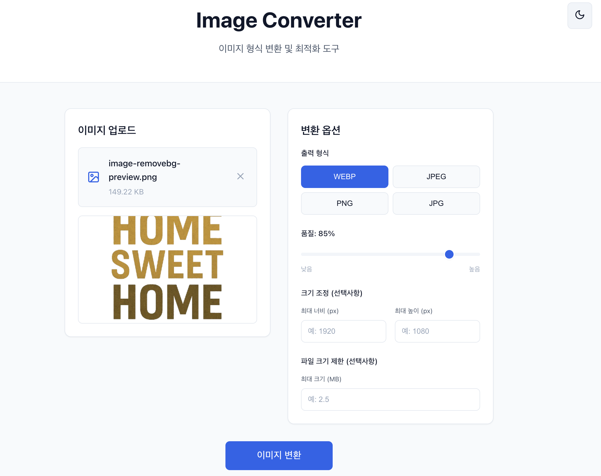

# Image Converter



현대적이고 사용자 친화적인 이미지 변환 및 최적화 도구입니다. React + TypeScript 프론트엔드와 FastAPI 백엔드로 구성되어 있습니다.

## 🚀 주요 기능

- **다양한 형식 지원**: WebP, JPEG, PNG, JPG 간 양방향 변환
- **스마트 크기 조정**: 비율을 유지하면서 최대 너비/높이로 조정
- **파일 크기 최적화**: 지정된 크기 이하로 자동 압축
- **드래그 앤 드롭**: 직관적인 파일 업로드 인터페이스
- **실시간 진행률**: 변환 과정을 시각적으로 표시
- **다크 테마**: 사용자 선호에 따른 테마 전환
- **반응형 디자인**: 모든 디바이스에서 최적화된 경험

## 🏗️ 아키텍처

```
┌─────────────────┐    ┌─────────────────┐
│   React SPA     │    │   FastAPI       │
│   (Frontend)    │◄──►│   (Backend)     │
│                 │    │                 │
│ • TypeScript    │    │ • Python 3.13+ │
│ • Zustand       │    │ • PIL/Pillow    │
│ • Tailwind CSS  │    │ • Pydantic v2   │
└─────────────────┘    └─────────────────┘
```

## 🛠️ 기술 스택

### Frontend
- **React 18** + **TypeScript**
- **Zustand** - 상태 관리
- **React Dropzone** - 파일 업로드
- **Lucide React** - 아이콘
- **CSS Variables** - 테마 시스템

### Backend
- **FastAPI** - 웹 프레임워크
- **Pillow (PIL)** - 이미지 처리
- **Pydantic v2** - 데이터 검증
- **uv** - 의존성 관리

### DevOps
- **Docker** - 컨테이너 런타임
- **Kubernetes** + **Helm**
- **GitHub Actions** - CI/CD
- **Harbor** - 컨테이너 레지스트리

## 🚀 빠른 시작

### 개발 환경 요구사항
- Python 3.13+
- Node.js 20+
 - uv
 - Docker (컨테이너 런타임)

### 로컬 개발

1. **저장소 클론**
```bash
git clone <repository-url>
cd image-converter
```

2. **셋업 스크립트 실행**
```bash
./setup.sh
```

3. **로컬 실행**
```bash
./run_local.sh
```

4. **브라우저에서 접속**
- Frontend: http://localhost:3000
- Backend API: http://localhost:8000
- API 문서: http://localhost:8000/docs

### 컨테이너로 실행

#### 로컬 개발 환경
```bash
# 간편 실행 스크립트 (권장)
./run_local.sh

# 또는 직접 실행
docker-compose up --build
```

#### CI/CD 환경 (Docker 우선)
```bash
# 전체 테스트 및 빌드 (CI 환경에서 자동 감지)
./run_and_test.sh
```

## 🧪 테스트

### 전체 테스트 실행
```bash
./run_and_test.sh
```

### 개별 테스트
```bash
# 백엔드 테스트
cd backend
pytest

# 프론트엔드 테스트
cd frontend
npm test

# 코드 품질 검사
cd backend
black --check .
isort --check-only .

cd frontend
npm run lint
npm run format:check
```

## 📦 배포

### Kubernetes 배포

#### 개발/테스트 환경
```bash
# 기본 values.yaml 사용
helm install image-converter ./infra/helm-chart
```

#### 프로덕션 환경
```bash
# kkamji_values.yaml 사용
helm install image-converter ./infra/helm-chart \
  -f ./infra/helm-chart/kkamji_values.yaml
```

### 환경별 설정
- **개발/테스트**: `values.yaml` (example 기본값)
- **프로덕션**: `kkamji_values.yaml` (실제 배포용)

## 🔧 설정

### 환경 변수

#### Backend
- `PYTHONPATH`: Python 모듈 경로 (기본값: `/app`)

#### Frontend
- `REACT_APP_API_URL`: 백엔드 API URL (기본값: `/api`)
  - 이 값은 프록시 경로를 의미하므로 코드에서는 `/v1`과 같이 접미사만 사용합니다.
- `BACKEND_ENDPOINT`: 프록시가 요청을 전달할 백엔드 서비스 주소
  - Docker Compose: `http://backend:8000`
  - Helm: `http://image-converter-backend:8000`

### 도메인 설정

#### 프로덕션 환경
- **Harbor 레지스트리**: harbor.kkamji.net
- **서비스 도메인**: image-converter.kkamji.net

## 📝 API 문서

### 주요 엔드포인트

- `POST /api/v1/convert` - 이미지 변환
- `GET /api/v1/formats` - 지원 형식 조회
- `GET /health` - 헬스 체크

자세한 API 문서는 http://localhost:8000/docs 에서 확인할 수 있습니다.

## 🤝 기여하기

1. Fork the repository
2. Create your feature branch (`git checkout -b feature/amazing-feature`)
3. Commit your changes (`git commit -m 'feat: add amazing feature'`)
4. Push to the branch (`git push origin feature/amazing-feature`)
5. Open a Pull Request

### 커밋 컨벤션
- `feat:` 새로운 기능
- `fix:` 버그 수정
- `docs:` 문서 변경
- `style:` 코드 포맷팅
- `refactor:` 코드 리팩토링
- `test:` 테스트 추가/수정
- `chore:` 빌드 프로세스 또는 보조 도구 변경

### 브랜치 및 Pull Request 규칙
- 모든 브랜치 이름과 Pull Request 제목은 **영어**로 작성합니다.

## 📄 라이선스

이 프로젝트는 MIT 라이선스 하에 배포됩니다. 자세한 내용은 [LICENSE](LICENSE) 파일을 참조하세요.

## 🐛 버그 리포트 & 기능 요청

이슈가 있거나 새로운 기능을 제안하고 싶으시면 [GitHub Issues](https://github.com/KKamJi98/image-converter/issues)를 이용해 주세요.

## 📞 지원

- 👨‍💻 개발자: TaeJi Kim
- 📧 Email: `rlaxowl5460@gmail.com`
